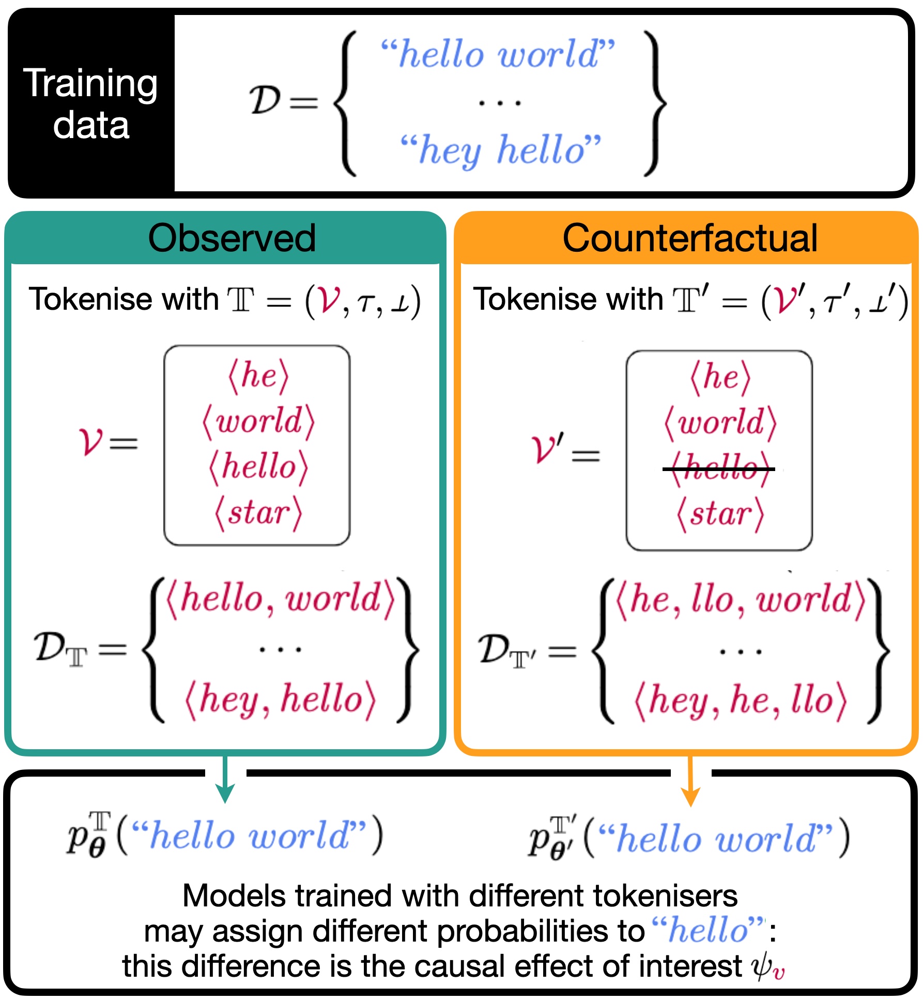

# Causal Estimation of Tokenisation Bias

<font size = "3">*Pietro Lesci, Clara Meister, Thomas Hofmann, Andreas Vlachos, and Tiago Pimentel*</font>

<br>

This is the official implementation for our ACL 2025 paper: "Causal Estimation of Tokenisation Bias".

<!-- [](https://arxiv.org/abs/2406.04327v1) -->

> **Abstract:** Modern language models are typically trained over subword sequences, but ultimately define probabilities over character-strings. Ideally, the choice of the tokeniser---which maps character-strings to subwords---should not affect the probability assigned to the underlying character-string; in practice, it does. We define this mismatch as **tokenisation bias**. In this work, we quantify one particular type of tokenisation bias: the effect of including or not a subword (e.g., $\langle hello \rangle$) in a tokeniser’s vocabulary on the probability a trained model assigns to the corresponding characters (i.e., _"hello"_). Estimating this effect is challenging because each model is trained with only one tokeniser. We address this by framing tokenisation bias as a causal effect and estimating it using the regression discontinuity design.  Specifically, we exploit the fact that tokenisation algorithms rank subwords and add the first $K$ to a tokeniser's vocabulary, where $K$ is an arbitrary cutoff point. As such, we can estimate a causal effect by comparing similar subwords around this cutoff. Experimentally, we find that tokenisation consistently affects models' outputs across scales, vocabularies, and tokenisers.  Notably, a subword's presence in a small model's vocabulary may increase its characters' probability by up to 17 times, highlighting tokenisation as a key design choice in language modelling.



Experimental artefacts and datasets are available as part of the [Tokenisation-Bias](https://huggingface.co/collections/pietrolesci/tokenisation-bias-66d5d0b40cb82a2d789b19db) collection on the Hugging Face Hub.

To reproduce our experiments, read below.


## Setup

Clone the repo with its submodules.

```bash
git clone --recurse-submodules https://github.com/pietrolesci/tokenisation-bias.git
```

Install environment manager and dependencies.

```bash
# install uv
curl -LsSf https://astral.sh/uv/install.sh | sh

# create environment
uv sync
```


> [!TIP]
> You can avoid running any of these steps yourself by using the artefacts available in the [Tokenisation-Bias](https://huggingface.co/collections/pietrolesci/tokenisation-bias-66d5d0b40cb82a2d789b19db) collection.


## Step 1 - Train tokenizers

In this step, we first train a tokeniser with a large vocabulary and then create smaller tokenisers of the desired size.
We use a patched version of the Hugging Face `tokenizers` library that saves information about merges and their counts. 
In this way, we can train the tokeniser once and create new tokenisers of arbitrary vocabulary sizes (of course, smaller than the maximum vocabulary size we used to train the tokeniser). 

First, train a tokenizer (BPE or WordPiece) with a large vocabulary (e.g., 320k tokens) on the Minipile dataset.

```bash
uv run cli.py tok train <bpe or wordpiece> minipile
```

This will save the tokeniser and useful metadata into a default folder named `{tok_type}_{dataset}_{"%Y-%m-%dT%H-%M-%S"}` under the default directory `outputs/tok_train`.
Once we have these "raw" tokenisers, we convert them to a format which is easily load-able with the `AutoTokenizer` class from the `transformers` library as follows:

```bash
uv run cli.py utils convert-tokenizer outputs/tok_train/<{tok_type}_{dataset}_{"%Y-%m-%dT%H-%M-%S"}> <vocab size>
```

This saves the `AutoTokenizer`-compliant tokenizers in the default directory `outputs/tokenizers` and each tokenizer is a folder named `{tok_type}{vocab_size}{dataset}`, where `tok_type` is automatically fetched from the parent tokenizer while `vocab_size` is hard-coded (we use 8k, 32k, 128k).


## Step 2 - Tokenise corpus

Once we have the tokenizers, in this step, we tokenize the MiniPile corpus. We stream the corpus from the Hugging Face Hub and save it again to the Hub to save space on the local disk.

```bash
# used for training
uv run cli.py tokenize outputs/tokenizers/<{tok_type}{vocab_size}> minipile
```

On the Hugging Face Hub, we create a repo `minipile` and for each tokeniser we have a folder. Within that folder, we have the different splits (e.g., train and validation).


## Step 3 - Train model

Once the dataset is tokenised, in this step, we train the models.

We support 3 model sizes (but you can easily add others by changing the `src.model` file). Specifically, you can pass `me57M-tied`, `smol_llama-370M-tied`, or `smol_llama-1B` to the `model` argument.
We use pytorch-lightning for training and transformers to define the model architectures.
For example, you can train `smol_llama-1B` on the MiniPile tokenised with `bpe32000minipile` on a node with 4 GPUs with batch size 128 as follows:

```bash
uv run primer/train.py --config-path ../experiments --config-name exp_default "$@" \
    model=me57M-tied \
    tok_name=wordpiece32000minipile \
    data.batch_size=16 \
    data.eval_batch_size=64
```

This will save model artefacts under the default directory `outputs/model_train/minipile` into a folder named `{model_name}-{tokeniser_name}_{"%Y-%m-%dT%H-%M-%S"}`. 

Look at `./bin/train.sh` for the commands to run to replicate our training pipeline.


## Step 4 - Collect Log-probabilities

Once we have trained models, we collect token log-probabilities on the validation set of the MiniPile.

> [!TIP]
> You can avoid running this step yourself by downloading the evaluations from the Hugging Face Hub at 
> [`pietrolesci/smol_llama-minipile-evals`](https://huggingface.co/datasets/pietrolesci/smol_llama-minipile-evals)
>
>```bash
>huggingface-cli download pietrolesci/me-minipile-evals --local-dir data/me-minipile-evals --repo-type dataset
>```
> or in Python
>```python
>from huggingface_hub import snapshot_download
>
>snapshot_download(
>    repo_id="pietrolesci/me-minipile-evals", 
>    repo_type="dataset", 
>    local_dir="data/me-minipile-evals",  # or another path 
>    allow_patterns=f"*.parquet",
>)
>```
> This should put all the parquet files into the `data/minipile/evals` folder.

We collect the log-probabilities as follows:

```bash
uv run scripts/model_eval.py -m \
    run_path=outputs/model_train/minipile/{model_name}-{tokeniser_name}_{"%Y-%m-%dT%H-%M-%S"} \
    checkpoint=step0,step2000,step4000  # you can put any other checkpoint
```

You can use the models we trained by loading them from the Hugging Face Hub as follows:

```bash
uv run scripts/model_eval.py \
    repo_id=pietrolesci/smol_llama-1B_bpe32000minipile \
    tok_path=/home/pl487/merge-effect/outputs/tokenizers/bpe32000minipile \  # Note: you need to pass the tok_path in this case!
    checkpoint=step0,step2000,step4000  # you can put any other checkpoint
```

Both commands result in evaluations being saved under `outputs/multirun/model_eval/minipile/{model_name}-{tokeniser_name}_{"%Y-%m-%dT%H-%M-%S"}`
in a folder named `step{the step}_{"%Y-%m-%dT%H-%M-%S"}`. 

Running this for each step separately is practically convenient, but to work with these files, it is better to have a single file for each model. 
To aggregate the evaluations per each step into a unique model-specific file run:

```bash
uv run scripts/export_evals.py
```

Which creates model-specific parquet files under `dataset/minipile/evals`.


## Step 5 - Analysis

Finally, once we have all the log-probabilities, we can start our analysis.

We go through this section using an example. Consider a window of size 1k and a tokeniser with a vocabulary of 32k. To estimate the causal effect at the cutoff
we get the log-probabilities for tokens `[31000, ..., 31999, 32000, ..., 32999]` from the evaluations we ran in the previous step.
Clearly, for tokens `[31000, ..., 31999]`, we can simply look up their log-probabilities. However, since tokens `[32000, 32999]` are not in the vocabulary, we cannot observe them.
Now, it becomes clear why we needed to train the "raw" tokenisers with a large vocabulary size: we need to know which tokens would have been merged to form
these out-of-vocabulary tokens; once we know this, we construct their log-probability by summing the log-probabilities of the component tokens (i.e., autoregressively). 
For example, say that token 32100 is formed by merging tokens 512 and 1020. Then, in our evaluations (previous step) we will search for all occurrencies of token 512 followed by token 1020 and sum their log-probabilities.
Then, we use the resulting log-probability to impute the one for token 32100.

Once we complete this process for each token in the window, we then average the log-probabilities for each token across documents (i.e., we compute the average log-probability per each token across contexts).

Finally, we run the regression model and get the estimate of the effect of a merge.

Both of these steps are implemented in the `./notebooks`.